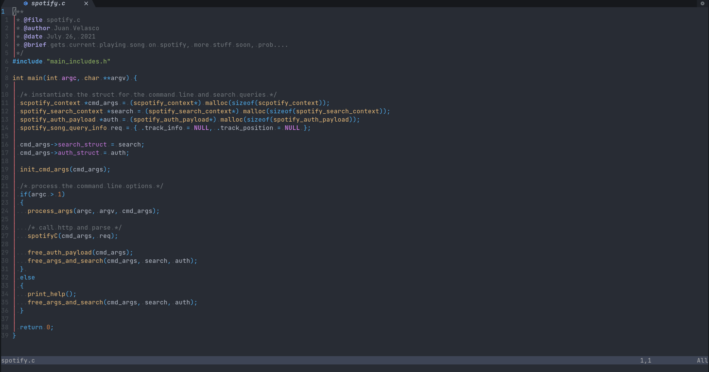
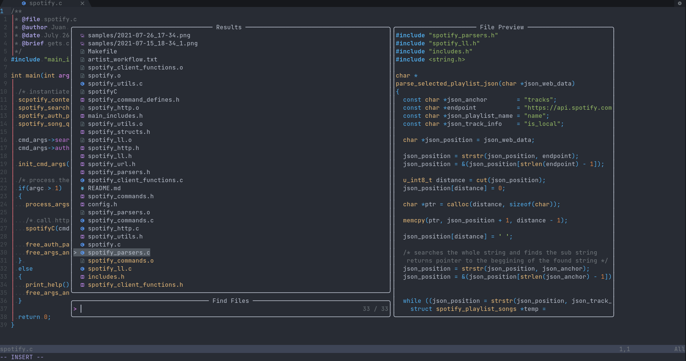
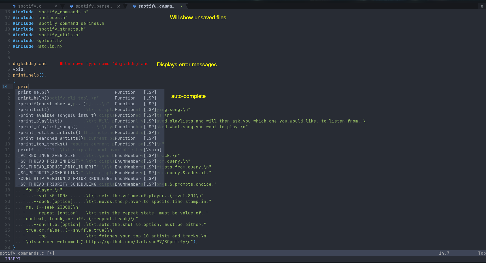
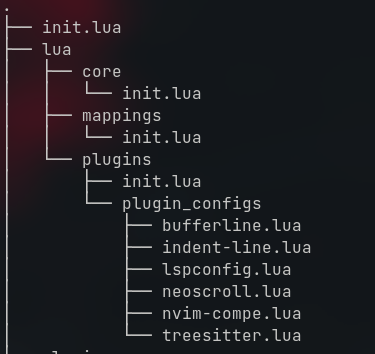

## My mappings
```
Leader = Space
Open telescope and find files in directory: <space>ff (Normal mode)  
Open telescope and find hidden files in directory: <space>fi (Normal mode)  
Open telescope and perform live grep on directory: <space>fg (Normal mode)  

Open tree: <Ctrl + n> (Normal mode)  
comment line: <leader>/ (Normal mode)  
comment line: <leader>/ (Visual mode)  

clear highlight: <ESC><ESC> (Normal mode)  

go to next tab in bufferline: <Tab> (Normal Mode)  
go to previous tab in bufferline: <Tab> (Normal Mode)  
close the tab in bufferline: <Shift + x>  

If you used Vscode in the past, you might have gotten used to just pressing tab or  
the arrow keys for traversing suggestions, I dont know why but that isnt the  
default, here is my quick fix for the issue.  

go up the snippet: <Ctrl + q> (insert mode)  
go down the snippet: <Ctrl + a> (insert mode)  
```


## Quick install of Packer.nvim

> Linux/Unix  

```
git clone --depth 1 https://github.com/wbthomason/packer.nvim\
 ~/.local/share/nvim/site/pack/packer/start/packer.nvim
```

> Windows  

```
git clone https://github.com/wbthomason/packer.nvim "$env:LOCALAPPDATA\nvim-data\site\pack\packer\start\packer.nvim"
```





